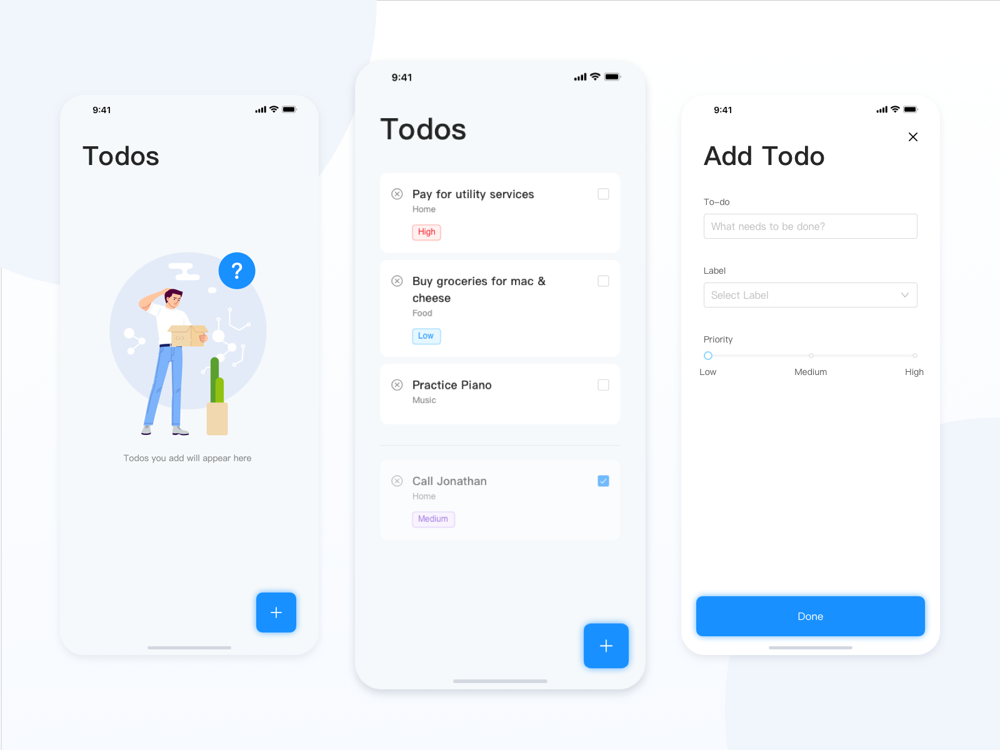

## Introduction

This app is based off of: https://github.com/itailv/awesome-todo-app.

<a href="https://itailv.github.io/awesome-todo-app/">
   
</a>

Various changes have been made, most significantly a backend that allows for persistent data storage.

## Technologies used

This project follows a custom structure that combines the following:

- [`TypeScript`](https://www.typescriptlang.org/) for extending JavaScript to be typed.
- [`React`](https://reactjs.org/) as the view layer of the app;
- [`Redux-Toolkit`](https://redux-toolkit.js.org/) for managing the app's state;
- [`Antd`](https://ant.design/) as the UI library;
- [`Webpack`](https://webpack.js.org/) as the main build tool for this app;
- [`Express`](https://expressjs.com/) as the Backend framework;

... and some [more stuff](./package.json).

## Running locally

You will need a running instance of MongoDB.

- Clone the repository.
- \[Optional\] create a .env file using .env example to change environment variables.
- Run the following within both the client and the server folders:

  ```
  npm install
  npm start
  ```

